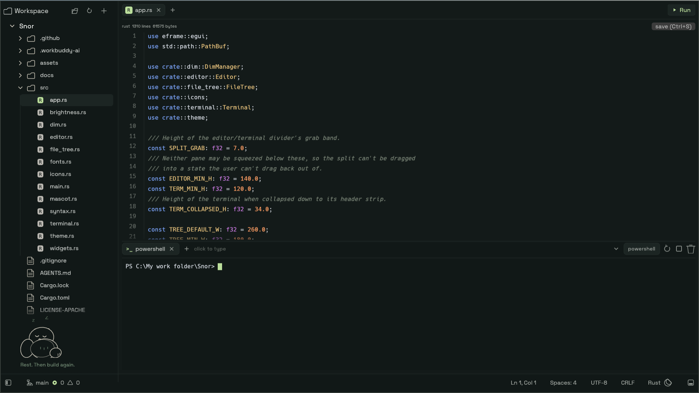
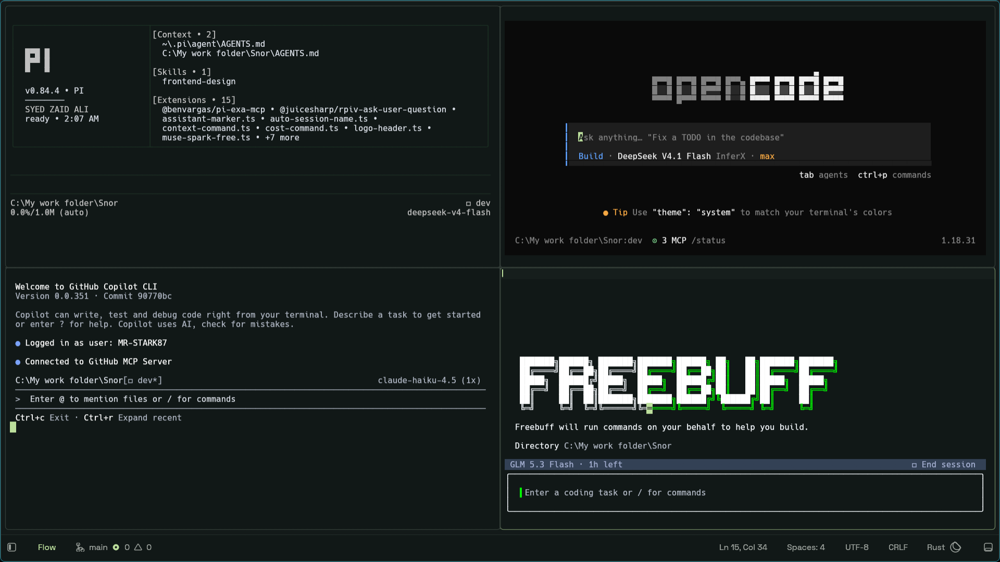
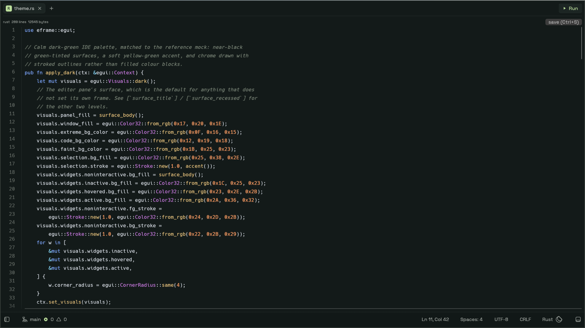
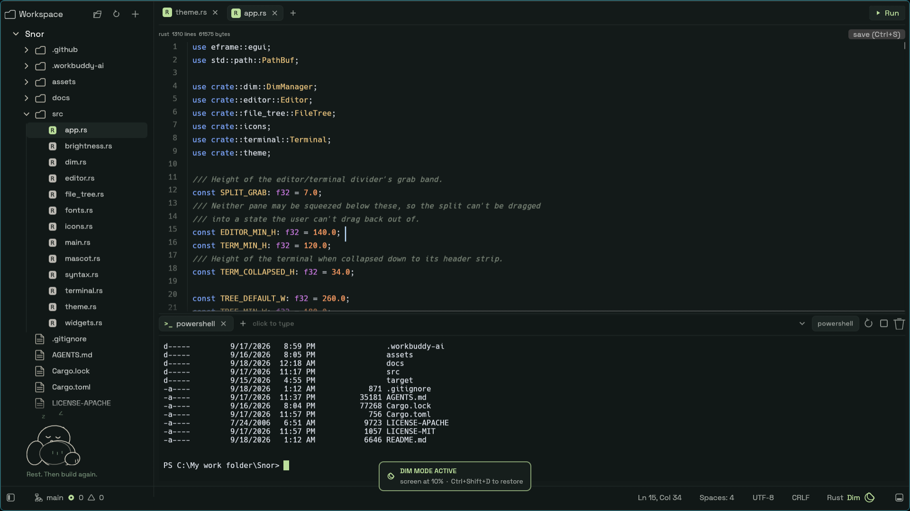
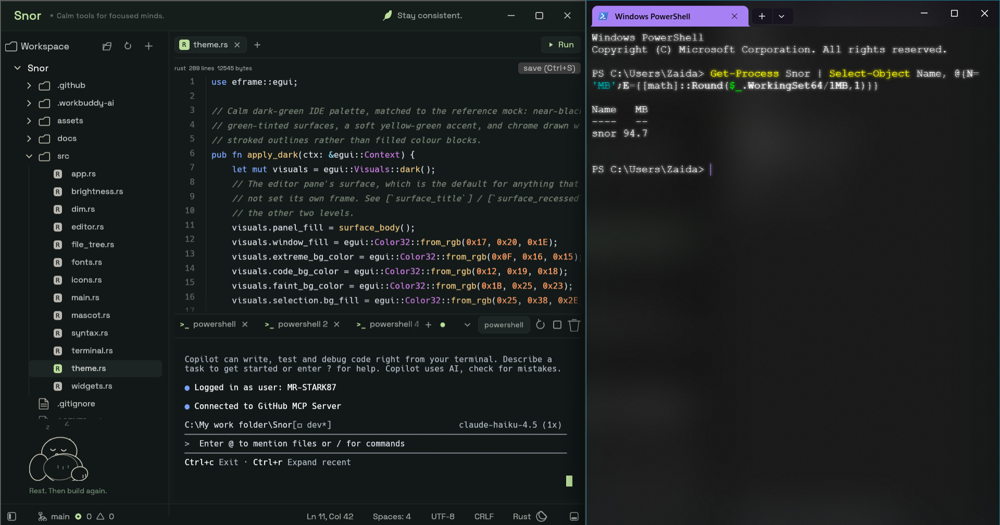

# Snor — a lightweight native workspace for agent-driven development

[](https://github.com/MR-STARK87/Snor/actions)
[](LICENSE-MIT)
[](https://github.com/MR-STARK87/Snor)

Snor is a minimal IDE in full Rust, designed around one idea: the developer's
job is shifting from typing every line of code to directing, supervising, and
collaborating with intelligent coding agents. It stays near 150 MB while doing
it — roughly a sixth of the ~980 MB mainstream editors can idle at.

> **Windows-only for now.** The terminal is ConPTY with `powershell.exe`, and
> extras like Dim Mode talk to Windows (WMI) directly. Portability comes
> later; honesty first.

## Why Snor?

AI coding agents are incredibly powerful, but the experience around them still
feels fragmented. A typical workflow means jumping between a terminal, an
editor, a file explorer, Git tools, and multiple agent sessions. On larger
projects, managing several agents at once can become just as difficult as
writing the code itself.

Snor was born from that problem. Instead of another general-purpose IDE, it is
an experiment in a calmer setup: one focused workspace where you see your
project, touch your files, and run multiple coding agents side by side —
without constantly switching tools.

## Features

**Agent-first workspace**
- Flow Mode (`Ctrl+Shift+F`): the whole window becomes live terminal panes —
  up to four shells side by side — for supervising agents. `Ctrl+Shift+H/V`
  splits, `Alt+arrows` moves focus between panes.
- Multi-session terminal: real ConPTY `powershell.exe -NoLogo -NoProfile`
  with colors and a block cursor behind a tab strip (`+` opens, click
  switches, closing the last tab hides the panel, `Ctrl+Tab` brings it back).
  Click any shell and type directly — Enter, arrows, Tab, Backspace, Ctrl+C
  all reach it. It answers DSR/CPR/DA queries so PSReadLine never blocks.
- The explorer follows the focused shell: it re-roots at the focused
  terminal's directory, and any folder's context menu offers
  `open terminal here` — the fastest way to give each agent its own corner.
- Dim Mode (`Ctrl+Shift+D`): lowers the physical backlight so long agent
  sessions can run with the screen dark. A moon in the status bar shows while
  active; machines without brightness control just get a notice.

**A calm editor underneath**
- Badge tabs, line-number gutter, tree-sitter highlighting (rust/json/js/toml
  with a keyword fallback for the rest, 100 KB tree-sitter cap, 500 KB
  large-file guard).
- In-file find (`Ctrl+F`, Enter for next, Shift+Enter for previous),
  `Ctrl+S` to save, and a Run button that sends `cargo run` to the terminal.
- File tree with create/rename/delete, auto-refresh via a filesystem watcher,
  and a resizable, collapsible explorer (`Ctrl+B`).

**Deliberately lean**
- No git integration — use your own client. No telemetry, no accounts, no
  cloud. No plugin system to feed.
- ~11 MB release binary (strip + thin LTO). 66 tests, clippy clean on every
  commit, CI on `main` and `dev`.

## Screenshots

One calm workspace — explorer, editor, terminal:



Flow Mode — four agents supervised side by side:



The editor up close — badge tabs, gutter, tree-sitter highlighting:



Dim Mode — backlight at 10%, overlay card and status-bar moon showing:



## Quickstart

Prerequisites: Windows 10/11 and a stable Rust toolchain
([rustup](https://rustup.rs)).

```powershell
cargo run --release
```

Debug builds keep a console window for logs; release builds hide it. Open a
folder from the top bar, open a terminal with `Ctrl+Tab`, and run your agent
of choice inside (the author drives it with `opencode`).

## Shortcuts

| Keys | Action |
|---|---|
| `Ctrl+B` | Toggle explorer |
| `Ctrl+Tab` | Toggle terminal |
| `Ctrl+Shift+F` | Flow Mode (side-by-side agent panes) |
| `Ctrl+Shift+H` / `Ctrl+Shift+V` | Split pane (enters Flow Mode) |
| `Alt+arrows` | Move pane focus |
| `Ctrl+Shift+D` | Dim Mode |
| `F11` | Fullscreen |
| `Ctrl+S` / `Ctrl+F` | Save / find in file |

## Memory

The project started with a simple bet: stay near 150 MB while mainstream
editors can idle near a gigabyte (Zed sat around ~980 MB on the author's
machine — that number is the origin of the goal, not a benchmark claim).

Read any reading as a peak, not a level: `WorkingSet64` counts resident pages
and Windows trims them freely for a backgrounded window, so the number swings
without the app releasing anything. Measured on one long-lived debug process:
`WorkingSetSize` 83.8 MB, `PeakWorkingSetSize` 155.8 MB, commit
(`PagefileUsage`) 147.3 MB. The ~155 MB quoted is the peak; commit is the
number that stays put.

| Version | Result |
|---|---|
| V1 debug / release | ~306–313 MB / ~331 MB, 17 MB exe |
| V1.1 (glow + strip + thin LTO) | ~173 MB / ~167 MB, 12.5 MB exe |
| Now | ~155 MB peak, ~147 MB commit, ~11 MB exe |

The trimming phenomenon, caught live: 94.7 MB resident *after* Windows
trimmed the backgrounded window — while peak sits at 155.8 and commit at
147.3. Same process, three numbers, which is why this section leads with
methodology instead of a single figure:



Reproduce it any time:

```powershell
Get-Process Snor | Select-Object Name, @{N='MB';E={[math]::Round($_.WorkingSet64/1MB,1)}}
```

## What Snor is not

- Not a Zed/VS Code replacement — no extensions, no settings sync, no
  multi-cursor power tools. If you live in those, keep living in them.
- Not cross-platform yet. See the note at the top.
- Not a git client, by design. That scope stays out so the memory number
  stays down.

## Roadmap

Roughly in order: stabilize the 1.0 workspace (editor + Flow + terminal),
signed release binaries on GitHub Releases, docs and screenshots, then
portability groundwork. Direction is set by use — what actually helps
supervise agents — not by feature parity with big editors.

## Tech

`eframe 0.36 / egui (glow) + ropey + tree-sitter-highlight + portable-pty
(ConPTY) + vt100 + notify + rfd`. Crate versions are pinned in `Cargo.lock`.
`AGENTS.md` documents the architecture and the verified gotchas for
contributors working with coding agents.

## Contributing

PRs welcome. The rules are short:

- One logical change per commit, `fix:` / `feat:` prefixes.
- `cargo clippy --all-targets -- -D warnings` clean and `cargo test` green —
  CI enforces both, and the bar is 66 passing tests.
- Keep it lean: no git integration, no telemetry, no emojis in code, commits,
  or docs.
- GUI behavior can't be verified headlessly — rebuild, relaunch, confirm by
  hand before claiming a visual fix works.

## License

MIT OR Apache-2.0 — see [`LICENSE-MIT`](LICENSE-MIT) and
[`LICENSE-APACHE`](LICENSE-APACHE).
