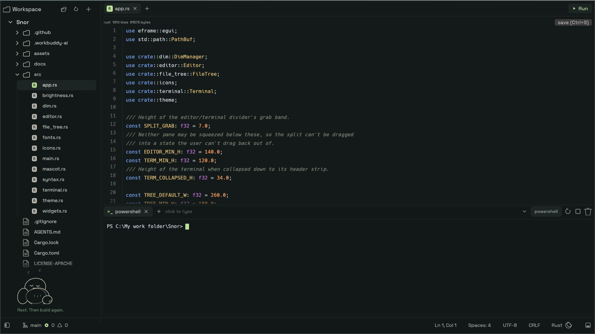
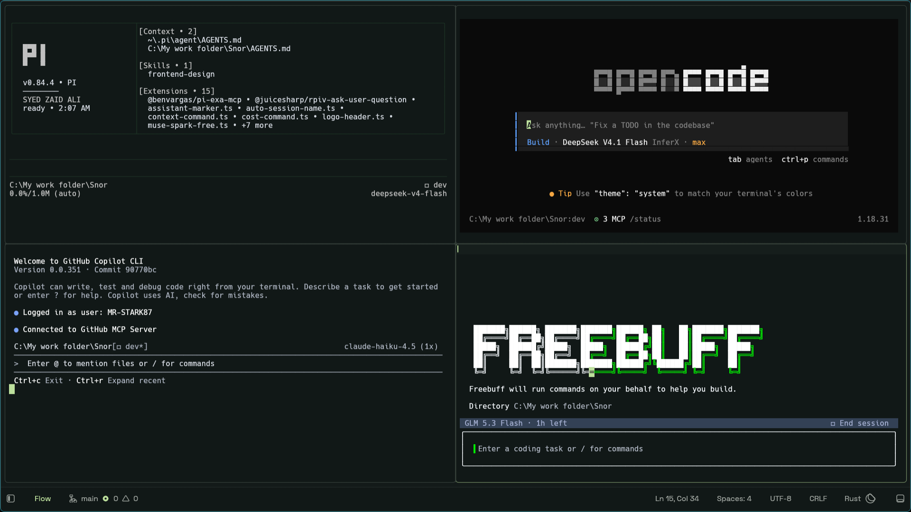
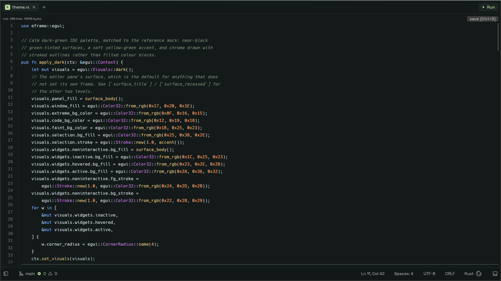
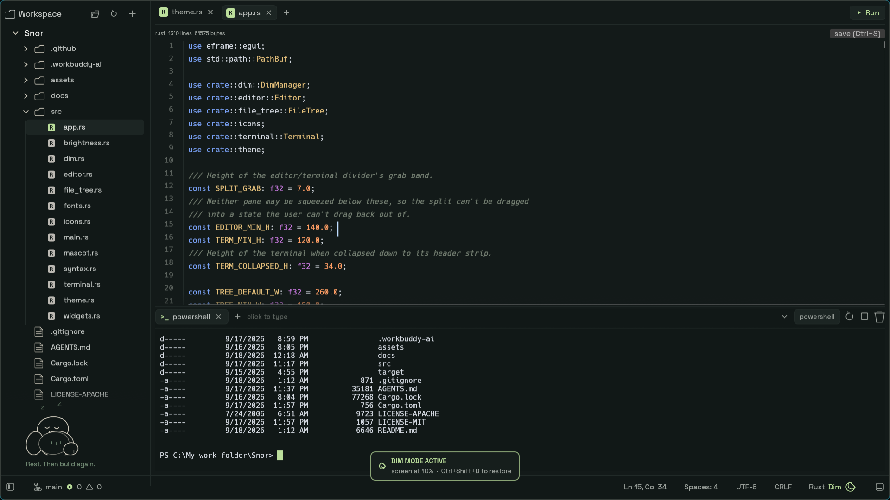
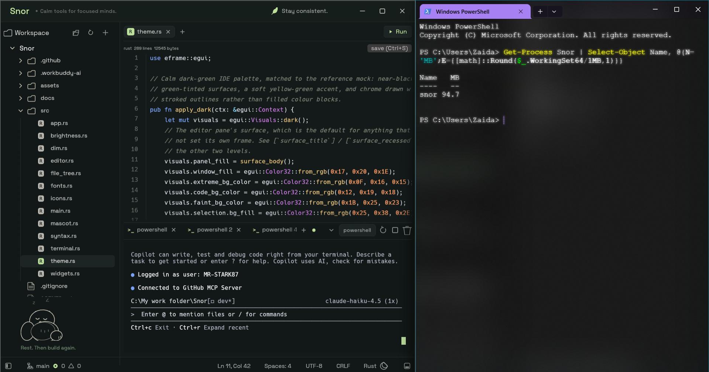

# Snor — a lightweight native workspace for agent-driven development

[](https://github.com/MR-STARK87/Snor/actions)
[](LICENSE-MIT)
[](https://github.com/MR-STARK87/Snor)

Snor is a minimal IDE in full Rust, designed around one idea: the developer's
job is shifting from typing every line of code to directing, supervising, and
collaborating with intelligent coding agents. It stays near 150 MB while doing
it — roughly a sixth of the ~980 MB mainstream editors can idle at.

> **Windows-only for now.** The terminal is ConPTY with `powershell.exe`, and
> extras like Dim Mode talk to Windows (WMI) directly. Portability comes
> later; honesty first.

## Why Snor?

AI coding agents are incredibly powerful, but the experience around them still
feels fragmented. A typical workflow means jumping between a terminal, an
editor, a file explorer, Git tools, and multiple agent sessions. On larger
projects, managing several agents at once can become just as difficult as
writing the code itself.

Snor was born from that problem. Instead of another general-purpose IDE, it is
an experiment in a calmer setup: one focused workspace where you see your
project, touch your files, and run multiple coding agents side by side —
without constantly switching tools.

## Features

**Agent-first workspace**
- Flow Mode (`Ctrl+Shift+F`): the whole window becomes live terminal panes —
  up to four shells side by side — for supervising agents. `Ctrl+Shift+H/V`
  splits, `Alt+arrows` moves focus between panes.
- Multi-session terminal: real ConPTY shells with colors and a block cursor
  behind a tab strip (`+` opens, click switches, right-click renames, closing
  the last tab hides the panel, `Ctrl+Tab` brings it back). Pick the shell new
  tabs start — PowerShell, PowerShell 7, Command Prompt, Git Bash or WSL — and
  each tab is named after the shell it runs. Click any shell and type directly —
  Enter, arrows, Tab, Backspace, Ctrl+C all reach it. It answers DSR/CPR/DA
  queries so PSReadLine never blocks.
- Terminal history that is actually reachable: the wheel scrolls back through
  1000 lines by default, find searches them (live output and history), and
  `Ctrl+Shift+C` copies the selection with the grid's padding trimmed off so it
  pastes cleanly. `Ctrl+wheel` zooms the grid text.
- Attention flags: a shell that rings its bell or retitles itself since you
  last focused it gets an accent mark on its tab or pane, and `Ctrl+Shift+A`
  jumps straight to the next one — no cycling to find out who is waiting. That
  is the one piece of state that makes four agents in four panes easier to
  supervise than one.
- Each Flow pane's header says what the shell last called itself (agents retitle
  the terminal as they work) and how long it has been quiet — accent while it is
  writing, faint once it stops. Whether an agent is working or waiting, without
  interrupting it.
- The explorer follows the focused shell: it re-roots at the focused
  terminal's directory, and any folder's context menu offers
  `open terminal here` — the fastest way to give each agent its own corner.
- Dim Mode (`Ctrl+Shift+D`): lowers the physical backlight so long agent
  sessions can run with the screen dark. A moon in the status bar shows while
  active; machines without brightness control just get a notice.
- A settings panel (the gear at the far right of the status bar) with eight
  knobs: the shell a new tab starts, the terminal and editor font sizes,
  scrollback rows, showing hidden files, whether the explorer follows the
  focused shell, the dim level and the UI scale. It applies as you touch it and
  writes `%APPDATA%\Snor\settings.toml`, so the sizes and zoom you chose come
  back on the next launch.

**A calm editor underneath**
- Badge tabs, line-number gutter, tree-sitter highlighting (rust/json/js/toml
  with a keyword fallback for the rest, 100 KB tree-sitter cap, 500 KB
  large-file guard).
- In-file find (`Ctrl+F`, Enter for next, Shift+Enter for previous),
  `Ctrl+S` to save, and a Run button that sends `cargo run` to the terminal.
- Files changed from outside — by an agent in the terminal, most likely —
  reload themselves while clean, and offer reload-or-keep-mine when the buffer
  has edits of its own, so a save cannot silently revert what an agent wrote.
  Closing a tab, or the window, with unsaved work asks first.
- File tree with create/rename/delete, auto-refresh via a filesystem watcher,
  and a resizable, collapsible explorer (`Ctrl+B`).

**Deliberately lean**
- No git integration — use your own client. The status bar reads `.git/HEAD`
  for the branch name, which is one 40-byte file and not a client. No
  telemetry, no accounts, no cloud. No plugin system to feed.
- ~11 MB release binary (strip + thin LTO). 106 app tests plus 19 installer
  tests, clippy clean on every commit, CI on `main` and `dev`.

## Screenshots

One calm workspace — explorer, editor, terminal:



Flow Mode — four agents supervised side by side:



The editor up close — badge tabs, gutter, tree-sitter highlighting:



Dim Mode — backlight at 10%, overlay card and status-bar moon showing:



## Quickstart

Prerequisites: Windows 10/11 and a stable Rust toolchain
([rustup](https://rustup.rs)).

```powershell
cargo run --release
```

Debug builds keep a console window for logs; release builds hide it. Open a
folder from the top bar, open a terminal with `Ctrl+Tab`, and run your agent
of choice inside (the author drives it with `opencode`).

## Building the installer

The setup wizard lives in `installer/` — a second crate in the same workspace,
wearing the app's own palette and window chrome (it compiles `theme.rs`,
`fonts.rs` and `icons.rs` straight out of `src/`, so the two can never drift).
It packs to a single distributable file:

```powershell
cargo build --release                        # the app
cargo build --release -p snor-installer      # the wizard and the packer
target/release/snor-pack.exe target/release/snor-setup.exe target/release/snor.exe dist/SnorSetup.exe
```

`dist\SnorSetup.exe` installs per-user (no administrator prompt), adds
optional Start Menu and desktop shortcuts, and registers an uninstaller that
runs the same wizard. See `installer/README.md` for the bundle format and the
whole flow.

## Shortcuts

| Keys | Action |
|---|---|
| `Ctrl+B` | Toggle explorer |
| `Ctrl+Tab` | Toggle terminal |
| `Ctrl+Shift+F` | Flow Mode (side-by-side agent panes) |
| `Ctrl+Shift+H` / `Ctrl+Shift+V` | Split pane (enters Flow Mode) |
| `Alt+arrows` | Move pane focus |
| `Ctrl+Shift+D` | Dim Mode |
| `F11` | Fullscreen |
| `Ctrl+S` / `Ctrl+F` | Save / find in file |
| `Ctrl+Shift+A` | Jump to the next shell (or tab) that needs attention |
| `Ctrl+Shift+C` / `Ctrl+Shift+V` | Copy selection / paste into the terminal |
| Wheel over a terminal | Scroll back through history |
| `Ctrl+wheel` | Zoom the terminal text |
| Right-click a terminal tab | Rename or close it |
| Magnifier in the terminal header | Find in output and history (Enter / Shift+Enter) |

## Memory

The project started with a simple bet: stay near 150 MB while mainstream
editors can idle near a gigabyte (Zed sat around ~980 MB on the author's
machine — that number is the origin of the goal, not a benchmark claim).

Read any reading as a peak, not a level: `WorkingSet64` counts resident pages
and Windows trims them freely for a backgrounded window, so the number swings
without the app releasing anything. Measured on one long-lived debug process:
`WorkingSetSize` 83.8 MB, `PeakWorkingSetSize` 155.8 MB, commit
(`PagefileUsage`) 147.3 MB. The ~155 MB quoted is the peak; commit is the
number that stays put.

| Version | Result |
|---|---|
| V1 debug / release | ~306–313 MB / ~331 MB, 17 MB exe |
| V1.1 (glow + strip + thin LTO) | ~173 MB / ~167 MB, 12.5 MB exe |
| Now | ~155 MB peak, ~147 MB commit, ~11 MB exe |

The trimming phenomenon, caught live: 94.7 MB resident *after* Windows
trimmed the backgrounded window — while peak sits at 155.8 and commit at
147.3. Same process, three numbers, which is why this section leads with
methodology instead of a single figure:



Reproduce it any time:

```powershell
Get-Process Snor | Select-Object Name, @{N='MB';E={[math]::Round($_.WorkingSet64/1MB,1)}}
```

## What Snor is not

- Not a Zed/VS Code replacement — no extensions, no settings sync, no
  multi-cursor power tools. If you live in those, keep living in them.
- Not cross-platform yet. See the note at the top.
- Not a git client, by design. That scope stays out so the memory number
  stays down; the branch in the status bar is read from `.git/HEAD` and nothing
  else about the repository is touched.

## Roadmap

Roughly in order: stabilize the 1.0 workspace (editor + Flow + terminal),
signed release binaries on GitHub Releases, docs and screenshots, then
portability groundwork. Direction is set by use — what actually helps
supervise agents — not by feature parity with big editors.

## Tech

`eframe 0.36 / egui (glow) + ropey + tree-sitter-highlight + portable-pty
(ConPTY) + vt100 + notify + rfd`. Crate versions are pinned in `Cargo.lock`.
`AGENTS.md` documents the architecture and the verified gotchas for
contributors working with coding agents.

## Contributing

PRs welcome. The rules are short:

- One logical change per commit, `fix:` / `feat:` prefixes.
- `cargo clippy --all-targets -- -D warnings` clean and `cargo test` green —
  CI enforces both, and the bar is 117 passing tests.
- Keep it lean: no git integration, no telemetry, no emojis in code, commits,
  or docs.
- GUI behavior can't be verified headlessly — rebuild, relaunch, confirm by
  hand before claiming a visual fix works.

## License

MIT OR Apache-2.0 — see [`LICENSE-MIT`](LICENSE-MIT) and
[`LICENSE-APACHE`](LICENSE-APACHE).
